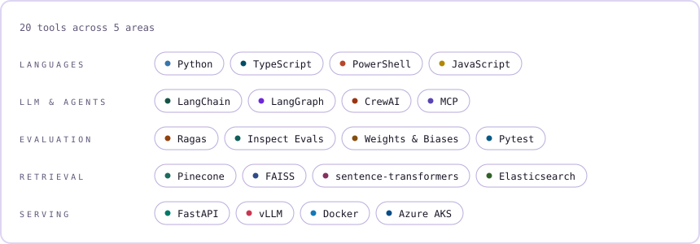
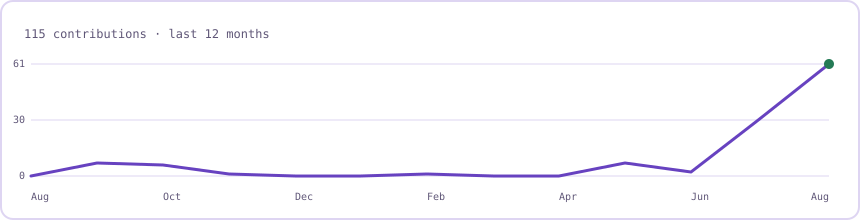
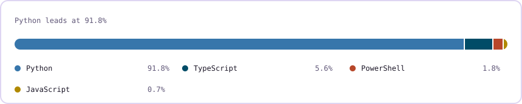

<picture>
  <source media="(prefers-color-scheme: dark)" srcset="./assets/terminal-dark.svg">
  
</picture>

### whoami

```json
{
  "name": "Parth Kulshreshtha",
  "role": "AI Systems Engineer",
  "building": "evaluation harnesses, agent systems, and the services that run them",
  "focus": [
    "LLM-as-Judge Evaluation",
    "RLVR Environments",
    "RAG",
    "Agent Workflows"
  ],
  "principles": [
    "the eval is the hard part",
    "maintainable beats impressive",
    "the model never gets the last word"
  ]
}
```

### Stack

<picture>
  <source media="(prefers-color-scheme: dark)" srcset="./assets/stack-dark.svg">
  
</picture>

### Contribution Activity

<picture>
  <source media="(prefers-color-scheme: dark)" srcset="./assets/activity-dark.svg">
  
</picture>

### Language Mix

<picture>
  <source media="(prefers-color-scheme: dark)" srcset="./assets/languages-dark.svg">
  
</picture>

### Let's Connect

<div align="center">

**I care more about whether it works than whether it demos. Say hello if you build the same way.**

<a href="https://linkedin.com/in/kulshreshtha-parth"> LinkedIn</a>
&nbsp;&nbsp;&nbsp;·&nbsp;&nbsp;&nbsp;
<a href="mailto:kulshreshthaparth@gmail.com"> Email</a>
&nbsp;&nbsp;&nbsp;·&nbsp;&nbsp;&nbsp;
<a href="https://github.com/that-rookie-parth?tab=followers"> Follow on GitHub</a>

</div>
